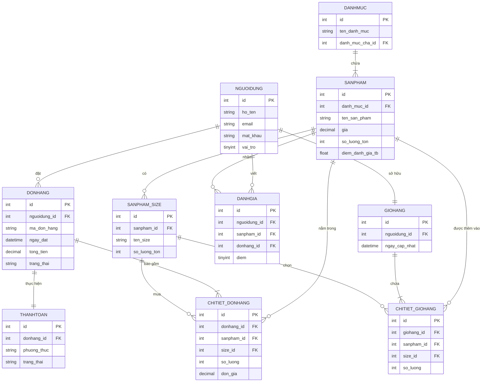

# BÁO CÁO ĐẶC TẢ YÊU CẦU VÀ MÔ HÌNH DỮ LIỆU

**Đề tài 7: Ứng dụng bán linh kiện máy vi tính**

---

## I. MÔ TẢ CHỨC NĂNG HỆ THỐNG

### 1. Phân quyền người dùng (Role-Based Access Control)
Hệ thống quản lý người dùng theo các cấp độ vai trò khác nhau, đáp ứng tính linh hoạt trong vận hành:
* **Khách hàng (User):** Người dùng hệ thống với mục đích tìm kiếm, mua sắm và theo dõi đơn hàng cá nhân.
* **Quản trị viên (Admin):** Nhân viên cửa hàng có quyền quản lý danh mục, sản phẩm và đơn hàng.
* **Quản trị cấp cao (Super Admin):** Quản lý toàn quyền hệ thống, bao gồm cả việc cấp phát, chuyển đổi vai trò (phân quyền) cho các tài khoản Admin khác.

### 2. Chi tiết Chức năng theo Vai trò

#### A. Đối với Khách hàng (User)
* **Quản lý tài khoản:** Đăng ký thành viên (có xác thực/kiểm tra dữ liệu đầu vào) và Đăng nhập hệ thống.
* **Tương tác Sản phẩm:**
  * Tìm kiếm linh kiện theo từ khóa.
  * Xem danh sách sản phẩm theo từng danh mục.
  * Xem thông tin chi tiết của từng sản phẩm.
  * Đánh giá và bình luận sản phẩm (Dữ liệu đánh giá được lưu vào CSDL để tính điểm trung bình).
* **Quản lý Giỏ hàng:**
  * Thêm sản phẩm vào giỏ hàng, cho phép chọn cụ thể "Size" (phiên bản, dung lượng) và số lượng cần mua.
  * Xem thống kê tổng số lượng các sản phẩm hiện có trong giỏ hàng.
* **Quản lý Đơn hàng:** Xem lại lịch sử các đơn hàng đã đặt và trạng thái hiện tại.

#### B. Đối với Quản trị viên (Admin / Super Admin)
* **Quản lý Người dùng:** Thêm mới, xóa, sửa thông tin người dùng và chuyển đổi vai trò (phân quyền).
* **Quản lý Danh mục:** Thêm mới, cập nhật, xóa các danh mục linh kiện máy tính.
* **Quản lý Sản phẩm:** Thêm mới, sửa thông tin, xóa sản phẩm thuộc từng loại danh mục cụ thể.
* **Quản lý Đơn hàng & Thống kê:**
  * Theo dõi và xử lý đơn hàng.
  * Thống kê lượng đặt hàng theo từng user.
  * Lọc dữ liệu theo ngày đặt, tháng đặt và từng loại danh mục.
  * Trích xuất danh sách các sản phẩm bán chạy nhất.

#### C. Các Yêu cầu Hệ thống Khác
* **Thanh toán trực tuyến:** Tích hợp chức năng thanh toán đơn hàng qua các App hoặc Service Online (Ví dụ: VNPay, MoMo, ZaloPay, Bank Transfer).
* **Hiển thị thông minh:** Tự động lọc và hiển thị danh sách "Sản phẩm bán chạy" và "Sản phẩm mới" trên giao diện chính.
* **Hệ thống Rating:** Hiển thị điểm đánh giá (số sao trung bình) minh bạch cho từng sản phẩm thông qua Trigger tự động.
* **Giao diện (UI/UX):** Đảm bảo thiết kế thân thiện, trực quan và dễ thao tác cho mọi đối tượng sử dụng.

---

## II. PHÂN TÍCH THỰC THỂ VÀ THUỘC TÍNH

Dựa trên yêu cầu, cơ sở dữ liệu được cấu trúc thành các thực thể chính sau:

1. **`NGUOIDUNG` (Người dùng):** Lưu trữ thông tin tài khoản (Họ tên, Email, Mật khẩu, SĐT, Địa chỉ). Thuộc tính `vai_tro` xác định quyền hạn.
2. **`DANHMUC` (Danh mục sản phẩm):** Phân loại linh kiện (CPU, RAM, Mainboard...). Hỗ trợ phân cấp danh mục cha - con.
3. **`SANPHAM` (Sản phẩm):** Chứa chi tiết linh kiện (Tên, Giá, Mô tả, Số lượng tồn, Hình ảnh). Liên kết với `DANHMUC`. Chứa các cờ để đánh dấu sản phẩm mới, bán chạy và điểm đánh giá trung bình.
4. **`SANPHAM_SIZE` (Phiên bản/Kích thước):** Phân loại chi tiết của một sản phẩm (Ví dụ: RAM 8GB, 16GB) và số lượng tồn kho tương ứng.
5. **`GIOHANG` & `CHITIET_GIOHANG` (Giỏ hàng):** Lưu trạng thái mua sắm tạm thời của người dùng, chi tiết đến từng sản phẩm, phiên bản và số lượng.
6. **`DONHANG` & `CHITIET_DONHANG` (Đơn hàng):** Lưu thông tin thanh toán, giao hàng, tổng tiền và trạng thái xử lý. Ghi nhận "cứng" mức giá và tên sản phẩm tại thời điểm mua để đảm bảo tính toàn vẹn lịch sử.
7. **`THANHTOAN` (Thanh toán):** Quản lý các giao dịch qua App/Service online, mã giao dịch và trạng thái thanh toán.
8. **`DANHGIA` (Đánh giá):** Liên kết giữa Khách hàng, Sản phẩm và Đơn hàng (chỉ cho phép đánh giá khi đã mua hàng thành công), lưu trữ số sao và bình luận.

---

## III. SƠ ĐỒ THỰC THỂ KẾT HỢP (ERD)

---

## IV. GIẢI THÍCH TÓM TẮT MÔ HÌNH (ERD)

Mô hình dữ liệu được thiết kế tập trung vào việc tối ưu hóa quy trình mua bán linh kiện máy tính, đảm bảo tính toàn vẹn dữ liệu lịch sử và dễ dàng mở rộng. Dưới đây là giải thích tóm tắt về các mối quan hệ và ý đồ thiết kế:

### 1. Các mối quan hệ cốt lõi (Relationships)

* **Quan hệ 1 - 1 (Một - Một):**
    * **`NGUOIDUNG` - `GIOHANG`:** Mỗi tài khoản người dùng chỉ sở hữu duy nhất một giỏ hàng đang hoạt động để lưu trữ các sản phẩm chọn mua tạm thời.
    * **`DONHANG` - `THANHTOAN`:** Mỗi đơn hàng gắn liền với một giao dịch thanh toán cụ thể, giúp đối soát mã giao dịch (VNPay, MoMo, Bank) một cách chính xác và dễ dàng.
* **Quan hệ 1 - N (Một - Nhiều):**
    * **`DANHMUC` - `SANPHAM`:** Một danh mục (VD: RAM) có thể chứa nhiều sản phẩm (RAM Kingston, RAM Corsair), nhưng một sản phẩm chỉ thuộc một danh mục cụ thể. *(Bảng `DANHMUC` còn tự liên kết với chính nó qua `danh_muc_cha_id` để tạo cấu trúc danh mục Cha - Con).*
    * **`NGUOIDUNG` - `DONHANG`:** Một người dùng có thể đặt nhiều đơn hàng theo thời gian.
    * **`SANPHAM` - `SANPHAM_SIZE`:** Một linh kiện có thể có nhiều phiên bản (Ví dụ: RAM có bản 8GB và 16GB). Mỗi phiên bản sẽ có một định danh (`size_id`) và số lượng tồn kho riêng biệt.
* **Quan hệ N - N (Nhiều - Nhiều) - Được phân rã qua bảng chi tiết:**
    * **Sản phẩm & Đơn hàng -> `CHITIET_DONHANG`:** Một đơn hàng bao gồm nhiều sản phẩm, một sản phẩm có thể nằm trong nhiều đơn hàng. Bảng `CHITIET_DONHANG` sinh ra để lưu thông tin mua sắm thực tế (số lượng, giá tiền lúc mua).
    * **Sản phẩm & Giỏ hàng -> `CHITIET_GIOHANG`:** Tương tự như đơn hàng, bảng này phân rã để lưu số lượng và kích cỡ sản phẩm đang chờ thanh toán của người dùng.

### 2. Các điểm sáng trong Thiết kế cần nhấn mạnh

* **Bảo toàn lịch sử giá (`don_gia` trong `CHITIET_DONHANG`):** Giá của linh kiện điện tử biến động liên tục. Việc sao chép và lưu cứng `don_gia` vào bảng chi tiết ngay tại thời điểm khách bấm đặt hàng giúp đảm bảo tổng tiền của hóa đơn cũ không bao giờ bị sai lệch, ngay cả khi Admin cập nhật giá mới ở bảng `SANPHAM`.
* **Quản lý tồn kho linh hoạt (`SANPHAM_SIZE`):** Việc tách riêng bảng `SANPHAM_SIZE` giúp quản lý độc lập số lượng tồn kho của từng biến thể sản phẩm (như dung lượng, tốc độ bus), đáp ứng đúng đặc thù đa dạng của ngành hàng linh kiện máy tính.
* **Đánh giá thực chất (Verified Purchase trong `DANHGIA`):** Bảng `DANHGIA` được thiết kế liên kết đồng thời với `sanpham_id`, `nguoidung_id` và `donhang_id`. Điều này khóa chặt logic hệ thống: **Chỉ những khách hàng đã thực sự mua thành công sản phẩm trong một đơn hàng cụ thể mới được phép để lại bình luận và chấm điểm**.
